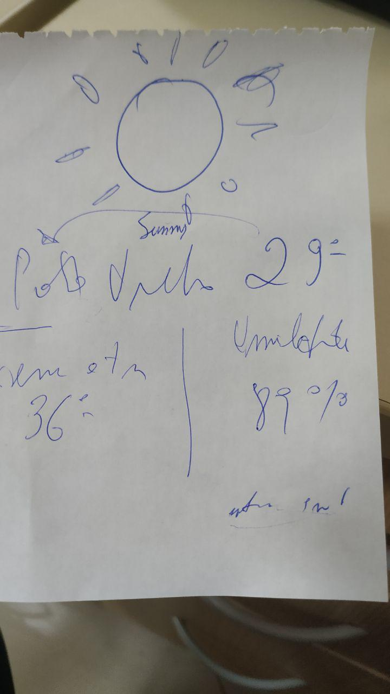

# clima-hoje
Extensão firefox para clima. Informe um estado e uma cidade brasileira ou simplesmente permita a indentificação da geolocalização e *voilà*

## Começando

Clone o repositório e fique para alterar API KEY

## Visual
Almejado: 

Alcançado:

### Pré-requisitos

Aqui usamos: Jquery, Chosen, Bootstrap, Pretty Date e Google Maps

## Contribuindo

Leia e para mais detalhes e se achar necessários faça seu Pull Request <3 (contribuindo is coming)
Entre em contato quando a sempre que achar necessário

## Autor

* **Vinícius Rio** - *Meu primeiro projeto de funcional* - [Vinicius Rio](https://github.com/ViniciusRio)

## Licença

Esse projeto é licenciado pelo MIT - veja aqui [LICENSE.md]

## Agradecimentos

* Repositório não existiria sem a motivação de três pessoas: - [Rafael Brasil](https://github.com/Daimioo), [Éverton Inocêncio](https://github.com/hewerthomn) e [Gustavo Gualbano](https://github.com/gsgualbano)
* Fui motivado a escrever essa extensão devido a existencia do primo próximo: [Dólar Hoje](https://github.com/Daimioo/dolarhoje)
* Atualizando sempre que possível
